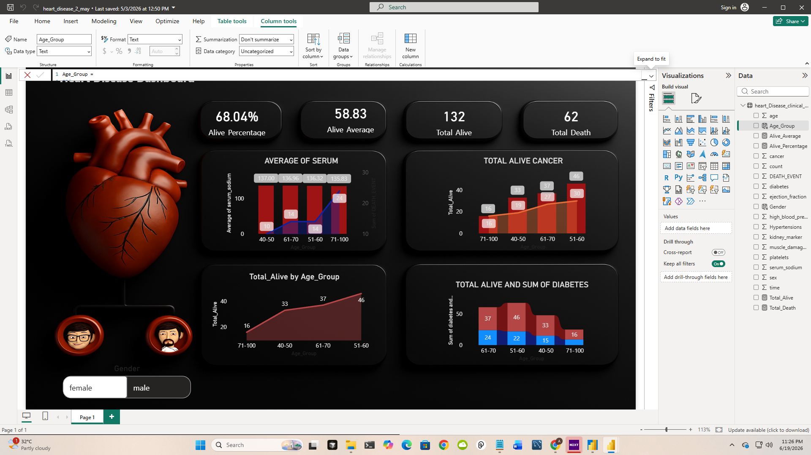

# ❤️ Heart Disease Analysis Dashboard | Power BI

## 📌 Project Overview

This project presents an interactive Power BI dashboard built using the Heart Failure Clinical Records Dataset. The dashboard helps analyze patient survival patterns, mortality rates, age distribution, diabetes impact, and serum sodium levels through visually appealing and interactive reports.

The objective is to transform raw healthcare data into actionable insights that can support data-driven decision-making in healthcare analytics.

---

## 📊 Dashboard Preview

> Save your dashboard screenshot inside the `Images` folder as `dashboard_overview.png`

```markdown

```

---

## 🎯 Key Business Questions

* What percentage of patients survived?
* How many patients experienced a death event?
* Which age groups show the highest survival rates?
* How does diabetes affect patient outcomes?
* How does serum sodium vary across age groups?
* What trends can be identified from patient demographics?

---

## 📈 Dashboard Features

### KPI Cards

* Alive Percentage
* Average Age of Surviving Patients
* Total Alive Patients
* Total Death Cases

### Visualizations

* Alive Count by Age Group
* Average Serum Sodium by Age Group
* Diabetes Analysis by Age Group
* Gender-Based Filtering
* Interactive Slicers

---

## 🛠️ Tools & Technologies

* Power BI Desktop
* Power Query
* DAX (Data Analysis Expressions)
* Data Modeling
* Data Visualization

---

## 📂 Dataset Information

The dataset contains clinical records of heart failure patients including:

* Age
* Gender
* Diabetes Status
* Serum Sodium
* Ejection Fraction
* Blood Pressure Indicators
* Death Event Status

---

## 📐 DAX Measures Used

### Alive Average Age

```DAX
Alive_Average =
CALCULATE(
    AVERAGE(heart_Disease_clinical_records_[age]),
    heart_Disease_clinical_records_[DEATH_EVENT] = 0
)
```

### Alive Percentage

```DAX
Alive_Percentage =
1 -
DIVIDE(
    SUM(heart_Disease_clinical_records_[DEATH_EVENT]),
    COUNT(heart_Disease_clinical_records_[count])
)
```

### Total Alive

```DAX
Total_Alive =
CALCULATE(
    COUNT(heart_Disease_clinical_records_[count]),
    heart_Disease_clinical_records_[DEATH_EVENT] = 0
)
```

### Total Death

```DAX
Total_Death =
CALCULATE(
    COUNT(heart_Disease_clinical_records_[count]),
    heart_Disease_clinical_records_[DEATH_EVENT] = 1
)
```

---

## 🔍 Key Insights

* Approximately **68.04%** of patients survived.
* Around **31.96%** of patients experienced a death event.
* The **51–60 age group** had the highest number of surviving patients.
* Diabetes prevalence varied across age groups.
* Serum sodium levels remained relatively stable among patient groups.
* Survival trends can be explored dynamically using gender filters.

---

## 📁 Project Structure

```text
Heart-Disease-PowerBI-Dashboard/
│
├── Dashboard/
│   └── Heart_Disease_Dashboard.pbix
│
├── Dataset/
│   └── heart_disease.csv
│
├── Images/
│   └── dashboard_overview.png
│
└── README.md
```

---

## 🚀 How to Use

1. Clone the repository.
2. Open the `.pbix` file using Power BI Desktop.
3. Refresh the dataset if required.
4. Explore dashboard interactions and filters.

---

## 👨‍💻 Author

Ashish Gupta

### Skills Demonstrated

* Data Analysis
* Data Visualization
* Healthcare Analytics
* DAX Calculations
* Dashboard Design
* Business Intelligence
* Data Storytelling

---

⭐ If you found this project useful, consider giving it a star.
